# BÁO CÁO THIẾT KẾ KIẾN TRÚC HỆ THỐNG
## HỆ THỐNG THƯƠNG MẠI ĐIỆN TỬ THỜI TRANG CAO CẤP TÍCH HỢP AI (AETHELGARD MALL)

---

## 🏗️ I. TỔNG QUAN KIẾN TRÚC HỆ THỐNG

Hệ thống được thiết kế theo mô hình **Khách - Chủ (Client-Server) hiện đại, phân tán và hướng dịch vụ**, tách biệt hoàn toàn giữa tầng giao diện hiển thị (**Frontend**) và tầng dịch vụ nghiệp vụ (**Backend API**). Toàn bộ hệ thống được đóng gói hoàn chỉnh bằng **Docker và Docker Compose**, đảm bảo tính nhất quán trên mọi môi trường vận hành.

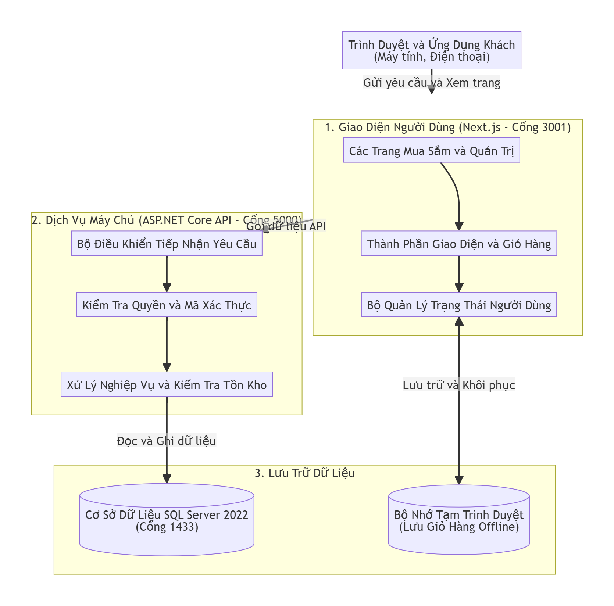

👁️ Nhấn vào đây để xem / chỉnh sửa mã nguồn Mermaid

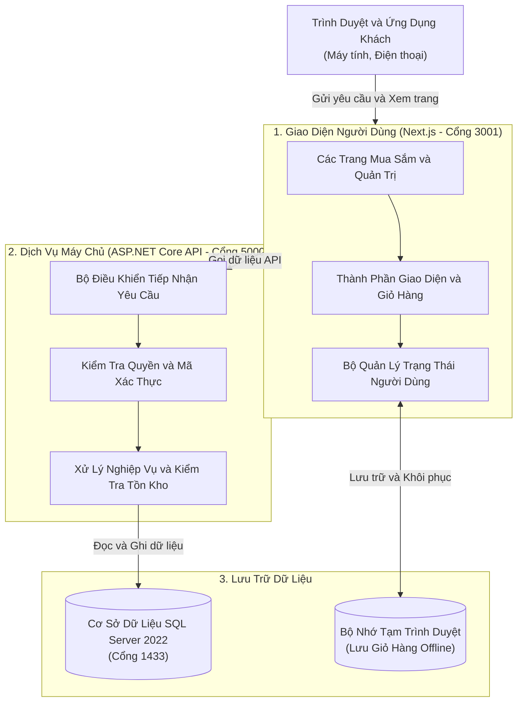
```mermaid
flowchart TD
    Client["Trình Duyệt và Ứng Dụng Khách<br/>(Máy tính, Điện thoại)"]

    subgraph WebApp ["1. Giao Diện Người Dùng (Next.js - Cổng 3001)"]
        direction TB
        Pages["Các Trang Mua Sắm và Quản Trị"]
        Components["Thành Phần Giao Diện và Giỏ Hàng"]
        Contexts["Bộ Quản Lý Trạng Thái Người Dùng"]
        Pages --> Components --> Contexts
    end

    subgraph WebApi ["2. Dịch Vụ Máy Chủ (ASP.NET Core API - Cổng 5000)"]
        direction TB
        Controllers["Bộ Điều Khiển Tiếp Nhận Yêu Cầu"]
        Security["Kiểm Tra Quyền và Mã Xác Thực"]
        Services["Xử Lý Nghiệp Vụ và Kiểm Tra Tồn Kho"]
        Controllers --> Security --> Services
    end

    subgraph Database ["3. Lưu Trữ Dữ Liệu"]
        SQL[("Cơ Sở Dữ Liệu SQL Server 2022<br/>(Cổng 1433)")]
        LocalStore[("Bộ Nhớ Tạm Trình Duyệt<br/>(Lưu Giỏ Hàng Offline)")]
    end

    Client -->|Gửi yêu cầu và Xem trang| WebApp
    Contexts <-->|Lưu trữ và Khôi phục| LocalStore
    WebApp -->|Gọi dữ liệu API| Controllers
    Services -->|Đọc và Ghi dữ liệu| SQL
```

---

## 🏛️ II. KIẾN TRÚC PHẦN MỀM (SOFTWARE ARCHITECTURE)

### 1. Kiến trúc Backend 4 Tầng Phân Lập
Mã nguồn máy chủ được phân chia thành 4 tầng riêng biệt nhằm đảm bảo nguyên lý đơn nhiệm và tính bảo trì cao:

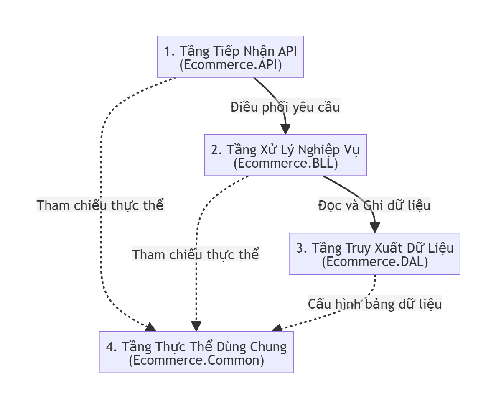

👁️ Nhấn vào đây để xem / chỉnh sửa mã nguồn Mermaid

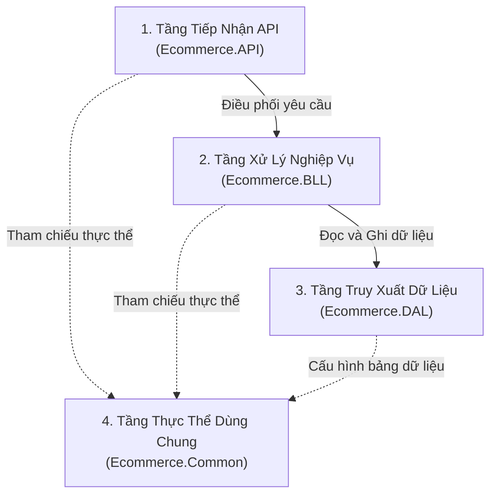
```mermaid
flowchart TD
    API["1. Tầng Tiếp Nhận API<br/>(Ecommerce.API)"]
    BLL["2. Tầng Xử Lý Nghiệp Vụ<br/>(Ecommerce.BLL)"]
    DAL["3. Tầng Truy Xuất Dữ Liệu<br/>(Ecommerce.DAL)"]
    Common["4. Tầng Thực Thể Dùng Chung<br/>(Ecommerce.Common)"]

    API -->|Điều phối yêu cầu| BLL
    BLL -->|Đọc và Ghi dữ liệu| DAL
    API -.->|Tham chiếu thực thể| Common
    BLL -.->|Tham chiếu thực thể| Common
    DAL -.->|Cấu hình bảng dữ liệu| Common
```

* **Tầng Tiếp Nhận API (`Ecommerce.API`)**: Tiếp nhận các yêu cầu gửi đến, điều hướng xử lý, kiểm tra mã xác thực tài khoản và ghi nhận nhật ký lỗi.
* **Tầng Xử Lý Nghiệp Vụ (`Ecommerce.BLL`)**: Chứa toàn bộ logic kinh doanh, thuật toán đối soát kho hàng, kiểm tra tính hợp lệ của đơn hàng và gợi ý thời trang thông minh.
* **Tầng Truy Xuất Dữ Liệu (`Ecommerce.DAL`)**: Tương tác trực tiếp với cơ sở dữ liệu qua Entity Framework Core 10, quản lý giao dịch an toàn và tối ưu hóa truy vấn.
* **Tầng Thực Thể Dùng Chung (`Ecommerce.Common`)**: Khai báo cấu trúc các bảng dữ liệu (`User`, `Product`, `Order`, `Review`, `Store`), mã danh mục và các kiểu dữ liệu trao đổi.

---

### 2. Kiến trúc Thành phần Giao diện Frontend
Cấu trúc giao diện được tổ chức theo từng lớp chức năng độc lập:

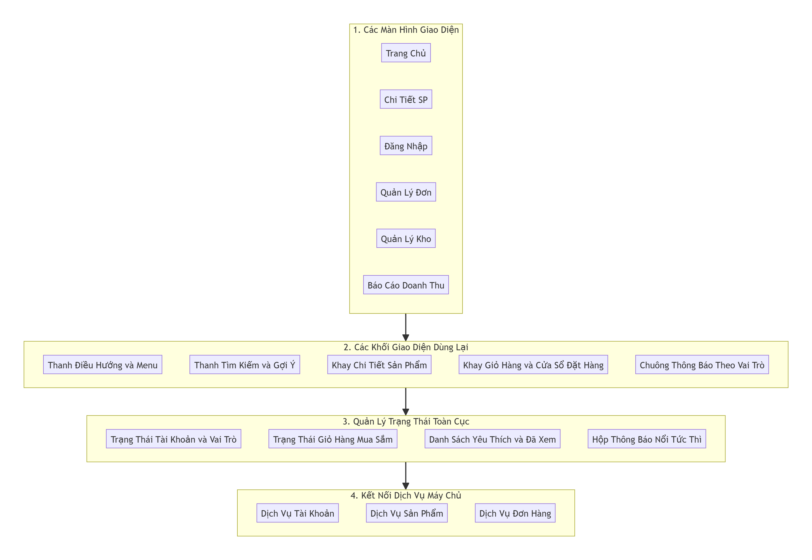

👁️ Nhấn vào đây để xem / chỉnh sửa mã nguồn Mermaid

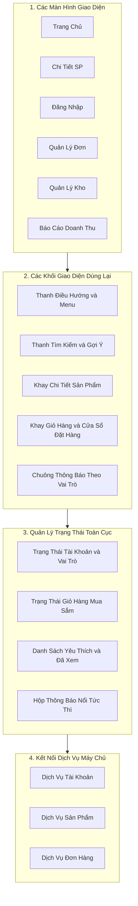
```mermaid
flowchart TD
    subgraph Pages ["1. Các Màn Hình Giao Diện"]
        direction LR
        P1["Trang Chủ"]
        P2["Chi Tiết SP"]
        P3["Đăng Nhập"]
        P4["Quản Lý Đơn"]
        P5["Quản Lý Kho"]
        P6["Báo Cáo Doanh Thu"]
    end

    subgraph Components ["2. Các Khối Giao Diện Dùng Lại"]
        C1["Thanh Điều Hướng và Menu"]
        C2["Thanh Tìm Kiếm và Gợi Ý"]
        C3["Khay Chi Tiết Sản Phẩm"]
        C4["Khay Giỏ Hàng và Cửa Sổ Đặt Hàng"]
        C5["Chuông Thông Báo Theo Vai Trò"]
    end

    subgraph Contexts ["3. Quản Lý Trạng Thái Toàn Cục"]
        X1["Trạng Thái Tài Khoản và Vai Trò"]
        X2["Trạng Thái Giỏ Hàng Mua Sắm"]
        X3["Danh Sách Yêu Thích và Đã Xem"]
        X4["Hộp Thông Báo Nổi Tức Thì"]
    end

    subgraph Services ["4. Kết Nối Dịch Vụ Máy Chủ"]
        S1["Dịch Vụ Tài Khoản"]
        S2["Dịch Vụ Sản Phẩm"]
        S3["Dịch Vụ Đơn Hàng"]
    end

    Pages --> Components
    Components --> Contexts
    Contexts --> Services
```

---

### 3. Luồng Quản lý Trạng thái Toàn cục
Biểu đồ mô tả cách dữ liệu được chia sẻ và đồng bộ giữa các màn hình:

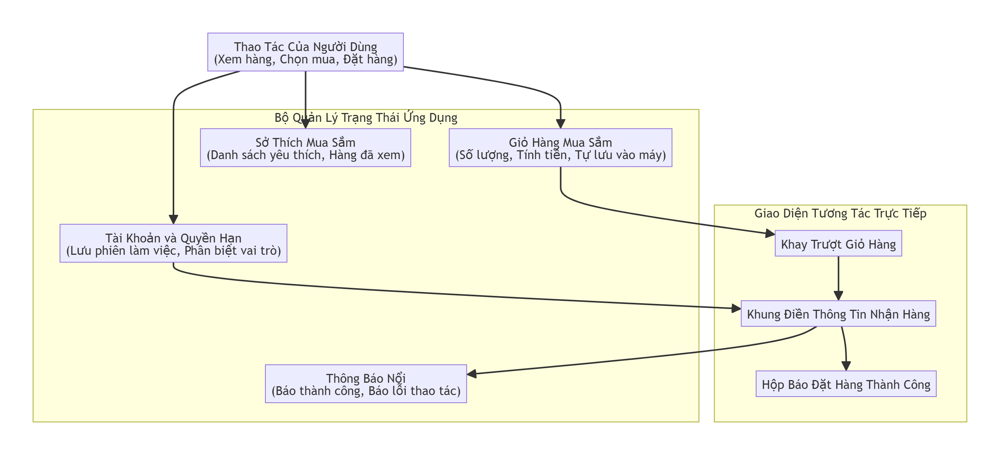

👁️ Nhấn vào đây để xem / chỉnh sửa mã nguồn Mermaid

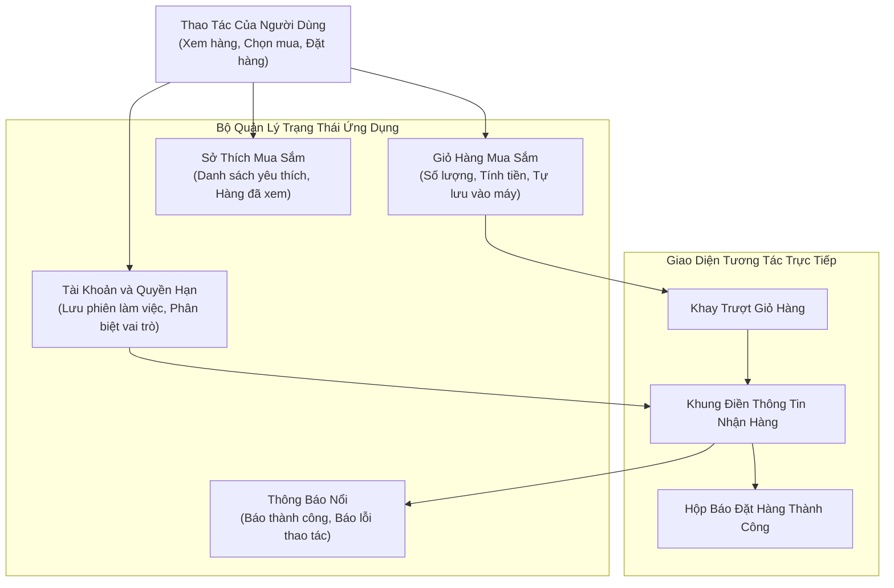
```mermaid
flowchart TD
    Action["Thao Tác Của Người Dùng<br/>(Xem hàng, Chọn mua, Đặt hàng)"]

    subgraph StateManager ["Bộ Quản Lý Trạng Thái Ứng Dụng"]
        UserCtx["Tài Khoản và Quyền Hạn<br/>(Lưu phiên làm việc, Phân biệt vai trò)"]
        CartCtx["Giỏ Hàng Mua Sắm<br/>(Số lượng, Tính tiền, Tự lưu vào máy)"]
        ShopperCtx["Sở Thích Mua Sắm<br/>(Danh sách yêu thích, Hàng đã xem)"]
        ToastCtx["Thông Báo Nổi<br/>(Báo thành công, Báo lỗi thao tác)"]
    end

    subgraph ViewLayer ["Giao Diện Tương Tác Trực Tiếp"]
        CartDrawer["Khay Trượt Giỏ Hàng"]
        CheckoutModal["Khung Điền Thông Tin Nhận Hàng"]
        SuccessModal["Hộp Báo Đặt Hàng Thành Công"]
    end

    Action --> UserCtx
    Action --> CartCtx
    Action --> ShopperCtx
    CartCtx --> CartDrawer --> CheckoutModal --> SuccessModal
    UserCtx --> CheckoutModal
    CheckoutModal --> ToastCtx
```

---

## 📊 III. BIỂU ĐỒ PHÂN RÃ CHỨC NĂNG (FDD)

Toàn bộ hệ thống được phân rã cân đối thành 4 nhóm nghiệp vụ chính:

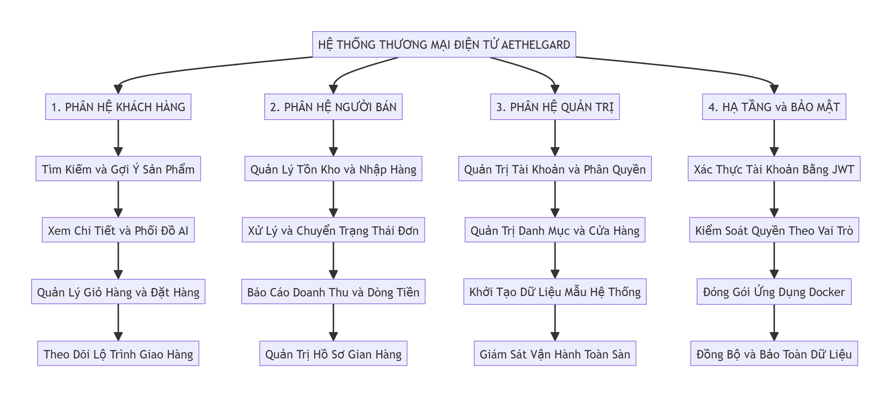

👁️ Nhấn vào đây để xem / chỉnh sửa mã nguồn Mermaid

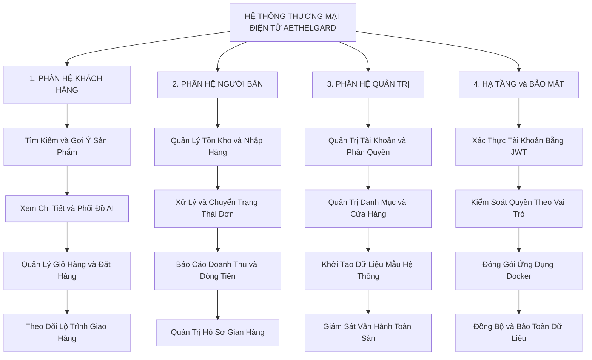
```mermaid
flowchart TD
    Root["HỆ THỐNG THƯƠNG MẠI ĐIỆN TỬ AETHELGARD"]

    Col1["1. PHÂN HỆ KHÁCH HÀNG"]
    Col2["2. PHÂN HỆ NGƯỜI BÁN"]
    Col3["3. PHÂN HỆ QUẢN TRỊ"]
    Col4["4. HẠ TẦNG và BẢO MẬT"]

    Root --> Col1
    Root --> Col2
    Root --> Col3
    Root --> Col4

    B1["Tìm Kiếm và Gợi Ý Sản Phẩm"]
    B2["Xem Chi Tiết và Phối Đồ AI"]
    B3["Quản Lý Giỏ Hàng và Đặt Hàng"]
    B4["Theo Dõi Lộ Trình Giao Hàng"]
    Col1 --> B1 --> B2 --> B3 --> B4

    S1["Quản Lý Tồn Kho và Nhập Hàng"]
    S2["Xử Lý và Chuyển Trạng Thái Đơn"]
    S3["Báo Cáo Doanh Thu và Dòng Tiền"]
    S4["Quản Trị Hồ Sơ Gian Hàng"]
    Col2 --> S1 --> S2 --> S3 --> S4

    A1["Quản Trị Tài Khoản và Phân Quyền"]
    A2["Quản Trị Danh Mục và Cửa Hàng"]
    A3["Khởi Tạo Dữ Liệu Mẫu Hệ Thống"]
    A4["Giám Sát Vận Hành Toàn Sàn"]
    Col3 --> A1 --> A2 --> A3 --> A4

    C1["Xác Thực Tài Khoản Bằng JWT"]
    C2["Kiểm Soát Quyền Theo Vai Trò"]
    C3["Đóng Gói Ứng Dụng Docker"]
    C4["Đồng Bộ và Bảo Toàn Dữ Liệu"]
    Col4 --> C1 --> C2 --> C3 --> C4
```

---

## 🎯 IV. CÁC BIỂU ĐỒ USE CASE (USE CASE DIAGRAMS)

### 1. Biểu đồ Use Case Tổng quát Toàn Hệ thống
Hệ thống phục vụ 3 nhóm tác nhân chính: **Khách hàng**, **Người bán**, và **Quản trị viên**.

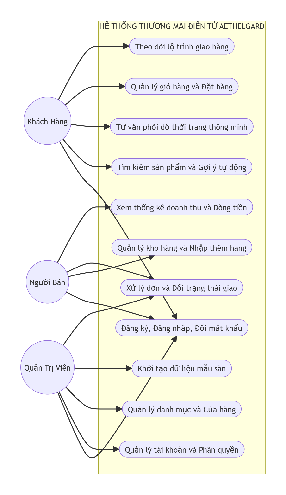

👁️ Nhấn vào đây để xem / chỉnh sửa mã nguồn Mermaid

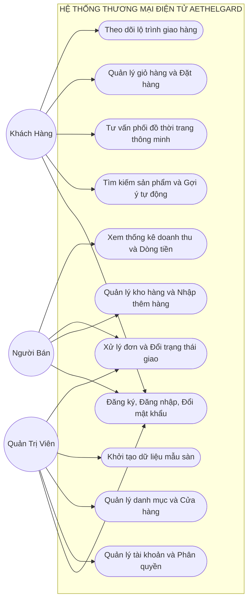
```mermaid
flowchart LR
    Buyer(("Khách Hàng"))
    Seller(("Người Bán"))
    Admin(("Quản Trị Viên"))

    subgraph System ["HỆ THỐNG THƯƠNG MẠI ĐIỆN TỬ AETHELGARD"]
        UC_Auth(["Đăng ký, Đăng nhập, Đổi mật khẩu"])
        UC_Search(["Tìm kiếm sản phẩm và Gợi ý tự động"])
        UC_AI(["Tư vấn phối đồ thời trang thông minh"])
        UC_Cart(["Quản lý giỏ hàng và Đặt hàng"])
        UC_Track(["Theo dõi lộ trình giao hàng"])

        UC_Inv(["Quản lý kho hàng và Nhập thêm hàng"])
        UC_Order(["Xử lý đơn và Đổi trạng thái giao"])
        UC_Finance(["Xem thống kê doanh thu và Dòng tiền"])

        UC_Users(["Quản lý tài khoản và Phân quyền"])
        UC_Category(["Quản lý danh mục và Cửa hàng"])
        UC_DataSeed(["Khởi tạo dữ liệu mẫu sàn"])
    end

    Buyer --> UC_Auth
    Buyer --> UC_Search
    Buyer --> UC_AI
    Buyer --> UC_Cart
    Buyer --> UC_Track

    Seller --> UC_Auth
    Seller --> UC_Inv
    Seller --> UC_Order
    Seller --> UC_Finance

    Admin --> UC_Auth
    Admin --> UC_Users
    Admin --> UC_Category
    Admin --> UC_DataSeed
    Admin --> UC_Order
```

---

### 2. Biểu đồ Use Case Chi tiết Phân hệ Khách hàng

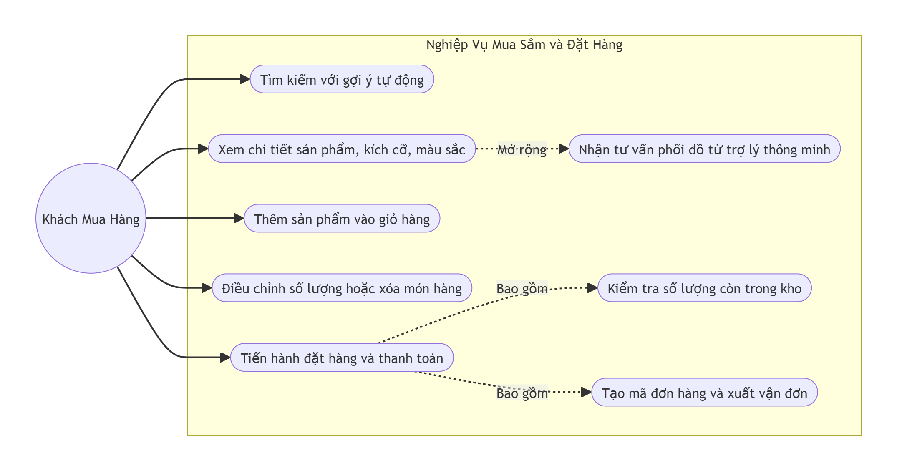

👁️ Nhấn vào đây để xem / chỉnh sửa mã nguồn Mermaid

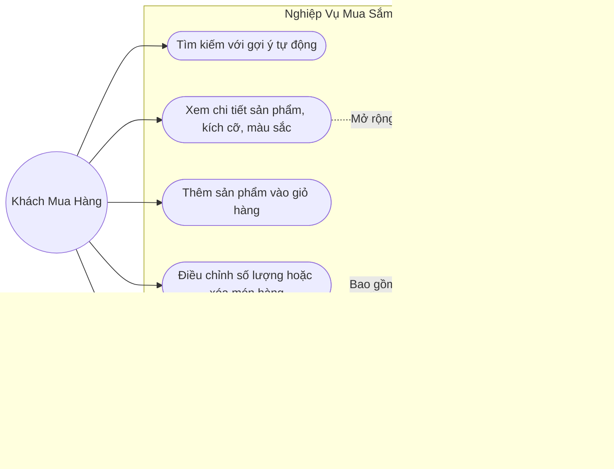
```mermaid
flowchart LR
    Customer(("Khách Mua Hàng"))

    subgraph BuyerUseCase ["Nghiệp Vụ Mua Sắm và Đặt Hàng"]
        UC1(["Tìm kiếm với gợi ý tự động"])
        UC2(["Xem chi tiết sản phẩm, kích cỡ, màu sắc"])
        UC3(["Nhận tư vấn phối đồ từ trợ lý thông minh"])
        UC4(["Thêm sản phẩm vào giỏ hàng"])
        UC5(["Điều chỉnh số lượng hoặc xóa món hàng"])
        UC6(["Tiến hành đặt hàng và thanh toán"])
        UC7(["Kiểm tra số lượng còn trong kho"])
        UC8(["Tạo mã đơn hàng và xuất vận đơn"])

        UC6 -.->|Bao gồm| UC7
        UC6 -.->|Bao gồm| UC8
        UC2 -.->|Mở rộng| UC3
    end

    Customer --> UC1
    Customer --> UC2
    Customer --> UC4
    Customer --> UC5
    Customer --> UC6
```

---

### 3. Biểu đồ Use Case Chi tiết Phân hệ Người bán

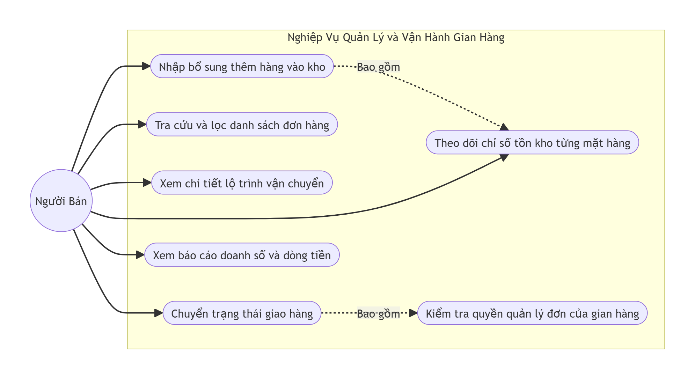

👁️ Nhấn vào đây để xem / chỉnh sửa mã nguồn Mermaid

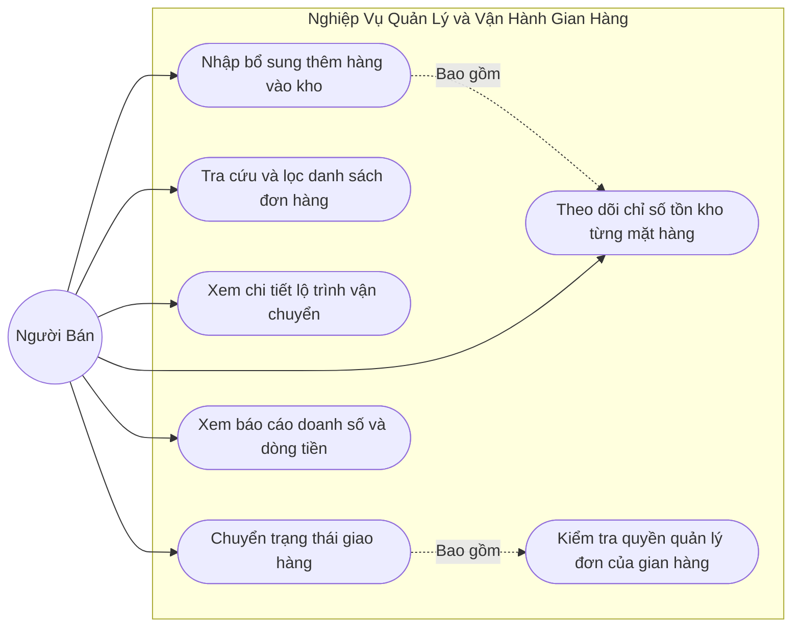
```mermaid
flowchart LR
    Seller(("Người Bán"))

    subgraph SellerUseCase ["Nghiệp Vụ Quản Lý và Vận Hành Gian Hàng"]
        S1(["Theo dõi chỉ số tồn kho từng mặt hàng"])
        S2(["Nhập bổ sung thêm hàng vào kho"])
        S3(["Tra cứu và lọc danh sách đơn hàng"])
        S4(["Xem chi tiết lộ trình vận chuyển"])
        S5(["Chuyển trạng thái giao hàng"])
        S6(["Kiểm tra quyền quản lý đơn của gian hàng"])
        S7(["Xem báo cáo doanh số và dòng tiền"])

        S2 -.->|Bao gồm| S1
        S5 -.->|Bao gồm| S6
    end

    Seller --> S1
    Seller --> S2
    Seller --> S3
    Seller --> S4
    Seller --> S5
    Seller --> S7
```

---

## 🗄️ V. BIỂU ĐỒ THỰC THỂ QUAN HỆ (ERD)

Mô hình dữ liệu quan hệ được chuẩn hóa theo chuẩn 3NF:

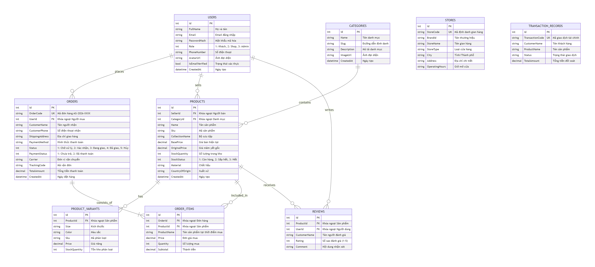

👁️ Nhấn vào đây để xem / chỉnh sửa mã nguồn Mermaid

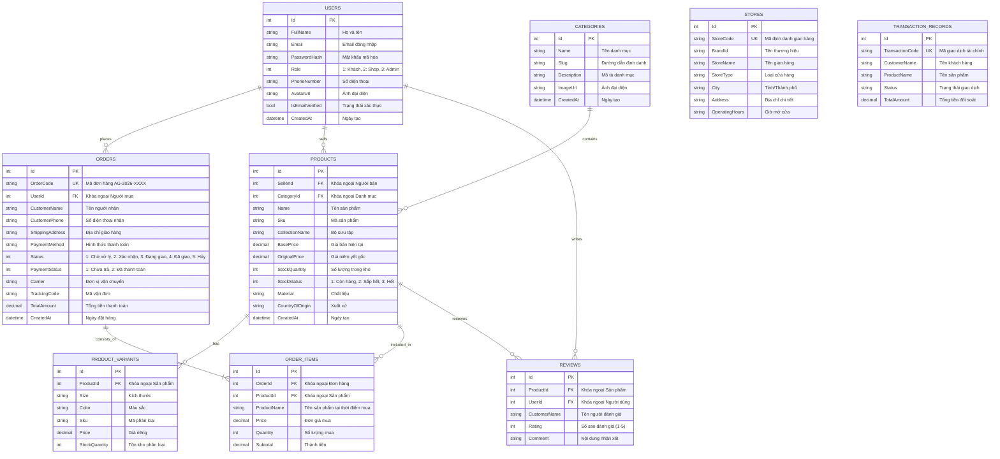
```mermaid
erDiagram
    USERS ||--o{ ORDERS : "places"
    USERS ||--o{ PRODUCTS : "sells"
    USERS ||--o{ REVIEWS : "writes"
    CATEGORIES ||--o{ PRODUCTS : "contains"
    PRODUCTS ||--o{ PRODUCT_VARIANTS : "has"
    PRODUCTS ||--o{ ORDER_ITEMS : "included_in"
    PRODUCTS ||--o{ REVIEWS : "receives"
    ORDERS ||--|{ ORDER_ITEMS : "consists_of"

    USERS {
        int Id PK
        string FullName "Họ và tên"
        string Email "Email đăng nhập"
        string PasswordHash "Mật khẩu mã hóa"
        int Role "1: Khách, 2: Shop, 3: Admin"
        string PhoneNumber "Số điện thoại"
        string AvatarUrl "Ảnh đại diện"
        bool IsEmailVerified "Trạng thái xác thực"
        datetime CreatedAt "Ngày tạo"
    }

    CATEGORIES {
        int Id PK
        string Name "Tên danh mục"
        string Slug "Đường dẫn định danh"
        string Description "Mô tả danh mục"
        string ImageUrl "Ảnh đại diện"
        datetime CreatedAt "Ngày tạo"
    }

    PRODUCTS {
        int Id PK
        int SellerId FK "Khóa ngoại Người bán"
        int CategoryId FK "Khóa ngoại Danh mục"
        string Name "Tên sản phẩm"
        string Sku "Mã sản phẩm"
        string CollectionName "Bộ sưu tập"
        decimal BasePrice "Giá bán hiện tại"
        decimal OriginalPrice "Giá niêm yết gốc"
        int StockQuantity "Số lượng trong kho"
        int StockStatus "1: Còn hàng, 2: Sắp hết, 3: Hết"
        string Material "Chất liệu"
        string CountryOfOrigin "Xuất xứ"
        datetime CreatedAt "Ngày tạo"
    }

    PRODUCT_VARIANTS {
        int Id PK
        int ProductId FK "Khóa ngoại Sản phẩm"
        string Size "Kích thước"
        string Color "Màu sắc"
        string Sku "Mã phân loại"
        decimal Price "Giá riêng"
        int StockQuantity "Tồn kho phân loại"
    }

    REVIEWS {
        int Id PK
        int ProductId FK "Khóa ngoại Sản phẩm"
        int UserId FK "Khóa ngoại Người dùng"
        string CustomerName "Tên người đánh giá"
        int Rating "Số sao đánh giá (1-5)"
        string Comment "Nội dung nhận xét"
    }

    ORDERS {
        int Id PK
        string OrderCode UK "Mã đơn hàng AG-2026-XXXX"
        int UserId FK "Khóa ngoại Người mua"
        string CustomerName "Tên người nhận"
        string CustomerPhone "Số điện thoại nhận"
        string ShippingAddress "Địa chỉ giao hàng"
        string PaymentMethod "Hình thức thanh toán"
        int Status "1: Chờ xử lý, 2: Xác nhận, 3: Đang giao, 4: Đã giao, 5: Hủy"
        int PaymentStatus "1: Chưa trả, 2: Đã thanh toán"
        string Carrier "Đơn vị vận chuyển"
        string TrackingCode "Mã vận đơn"
        decimal TotalAmount "Tổng tiền thanh toán"
        datetime CreatedAt "Ngày đặt hàng"
    }

    ORDER_ITEMS {
        int Id PK
        int OrderId FK "Khóa ngoại Đơn hàng"
        int ProductId FK "Khóa ngoại Sản phẩm"
        string ProductName "Tên sản phẩm tại thời điểm mua"
        decimal Price "Đơn giá mua"
        int Quantity "Số lượng mua"
        decimal Subtotal "Thành tiền"
    }

    STORES {
        int Id PK
        string StoreCode UK "Mã định danh gian hàng"
        string BrandId "Tên thương hiệu"
        string StoreName "Tên gian hàng"
        string StoreType "Loại cửa hàng"
        string City "Tỉnh/Thành phố"
        string Address "Địa chỉ chi tiết"
        string OperatingHours "Giờ mở cửa"
    }

    TRANSACTION_RECORDS {
        int Id PK
        string TransactionCode UK "Mã giao dịch tài chính"
        string CustomerName "Tên khách hàng"
        string ProductName "Tên sản phẩm"
        string Status "Trạng thái giao dịch"
        decimal TotalAmount "Tổng tiền đối soát"
    }
```

---

## ⏱️ VI. CÁC BIỂU ĐỒ TUẦN TỰ (SEQUENCE DIAGRAMS)

### 1. Luồng Xác thực Đăng nhập và Phân quyền

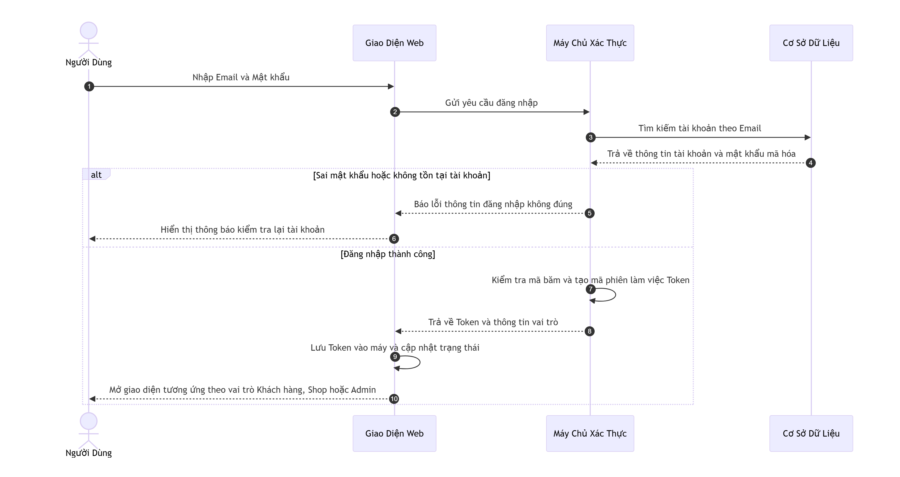

👁️ Nhấn vào đây để xem / chỉnh sửa mã nguồn Mermaid

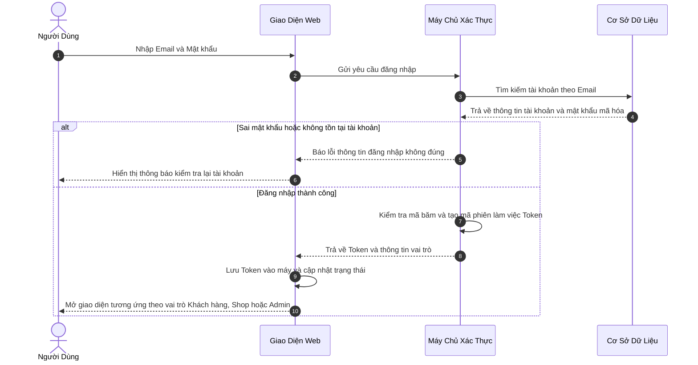
```mermaid
sequenceDiagram
    autonumber
    actor User as Người Dùng
    participant UI as Giao Diện Web
    participant AuthAPI as Máy Chủ Xác Thực
    participant DB as Cơ Sở Dữ Liệu

    User->>UI: Nhập Email và Mật khẩu
    UI->>AuthAPI: Gửi yêu cầu đăng nhập
    AuthAPI->>DB: Tìm kiếm tài khoản theo Email
    DB-->>AuthAPI: Trả về thông tin tài khoản và mật khẩu mã hóa
    
    alt Sai mật khẩu hoặc không tồn tại tài khoản
        AuthAPI-->>UI: Báo lỗi thông tin đăng nhập không đúng
        UI-->>User: Hiển thị thông báo kiểm tra lại tài khoản
    else Đăng nhập thành công
        AuthAPI->>AuthAPI: Kiểm tra mã băm và tạo mã phiên làm việc Token
        AuthAPI-->>UI: Trả về Token và thông tin vai trò
        UI->>UI: Lưu Token vào máy và cập nhật trạng thái
        UI-->>User: Mở giao diện tương ứng theo vai trò Khách hàng, Shop hoặc Admin
    end
```

---

### 2. Luồng Tìm kiếm Thời gian thực và Gợi ý Thông minh

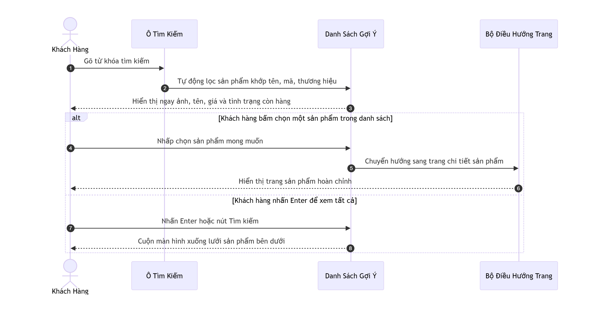

👁️ Nhấn vào đây để xem / chỉnh sửa mã nguồn Mermaid

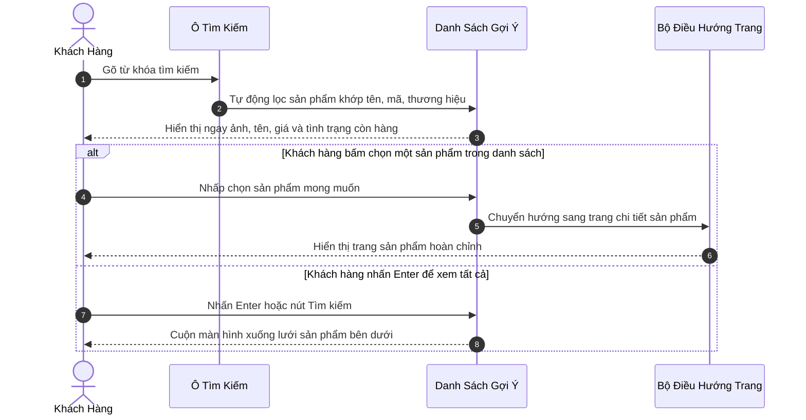
```mermaid
sequenceDiagram
    autonumber
    actor Customer as Khách Hàng
    participant SearchBar as Ô Tìm Kiếm
    participant Dropdown as Danh Sách Gợi Ý
    participant Router as Bộ Điều Hướng Trang

    Customer->>SearchBar: Gõ từ khóa tìm kiếm
    SearchBar->>Dropdown: Tự động lọc sản phẩm khớp tên, mã, thương hiệu
    Dropdown-->>Customer: Hiển thị ngay ảnh, tên, giá và tình trạng còn hàng

    alt Khách hàng bấm chọn một sản phẩm trong danh sách
        Customer->>Dropdown: Nhấp chọn sản phẩm mong muốn
        Dropdown->>Router: Chuyển hướng sang trang chi tiết sản phẩm
        Router-->>Customer: Hiển thị trang sản phẩm hoàn chỉnh
    else Khách hàng nhấn Enter để xem tất cả
        Customer->>Dropdown: Nhấn Enter hoặc nút Tìm kiếm
        Dropdown-->>Customer: Cuộn màn hình xuống lưới sản phẩm bên dưới
    end
```

---

### 3. Luồng Khách hàng Đặt hàng và Khóa Tồn kho Chống Bán Khống

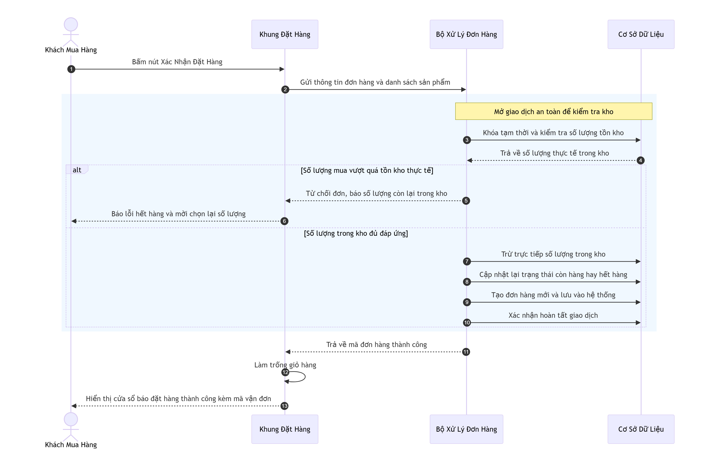

👁️ Nhấn vào đây để xem / chỉnh sửa mã nguồn Mermaid

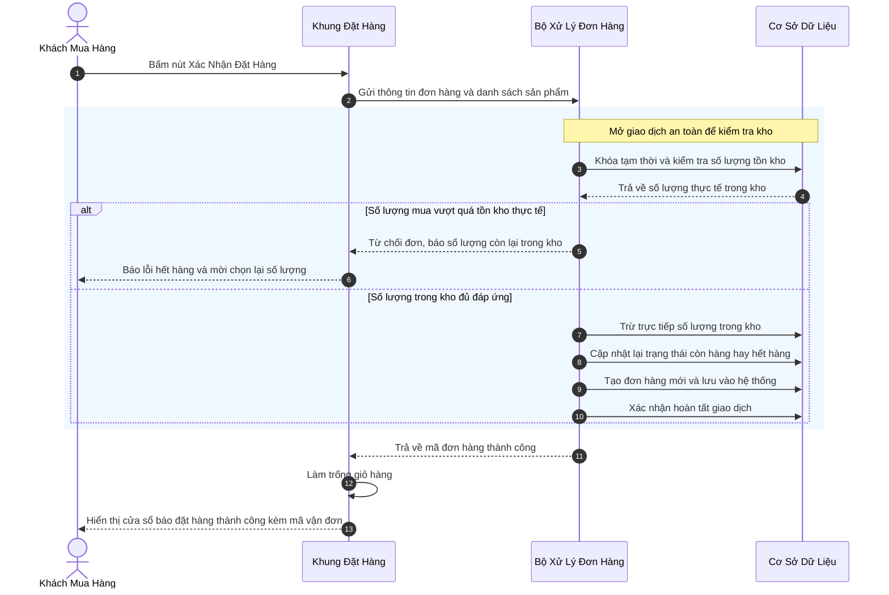
```mermaid
sequenceDiagram
    autonumber
    actor Customer as Khách Mua Hàng
    participant CheckoutUI as Khung Đặt Hàng
    participant OrderService as Bộ Xử Lý Đơn Hàng
    participant DB as Cơ Sở Dữ Liệu

    Customer->>CheckoutUI: Bấm nút Xác Nhận Đặt Hàng
    CheckoutUI->>OrderService: Gửi thông tin đơn hàng và danh sách sản phẩm
    
    rect rgb(240, 248, 255)
        note over OrderService, DB: Mở giao dịch an toàn để kiểm tra kho
        OrderService->>DB: Khóa tạm thời và kiểm tra số lượng tồn kho
        DB-->>OrderService: Trả về số lượng thực tế trong kho
        
        alt Số lượng mua vượt quá tồn kho thực tế
            OrderService-->>CheckoutUI: Từ chối đơn, báo số lượng còn lại trong kho
            CheckoutUI-->>Customer: Báo lỗi hết hàng và mời chọn lại số lượng
        else Số lượng trong kho đủ đáp ứng
            OrderService->>DB: Trừ trực tiếp số lượng trong kho
            OrderService->>DB: Cập nhật lại trạng thái còn hàng hay hết hàng
            OrderService->>DB: Tạo đơn hàng mới và lưu vào hệ thống
            OrderService->>DB: Xác nhận hoàn tất giao dịch
        end
    end

    OrderService-->>CheckoutUI: Trả về mã đơn hàng thành công
    CheckoutUI->>CheckoutUI: Làm trống giỏ hàng
    CheckoutUI-->>Customer: Hiển thị cửa sổ báo đặt hàng thành công kèm mã vận đơn
```

---

### 4. Luồng Người bán Nhập thêm hàng vào kho

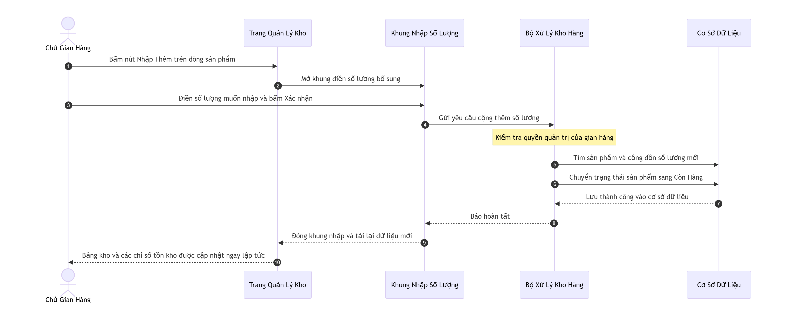

👁️ Nhấn vào đây để xem / chỉnh sửa mã nguồn Mermaid

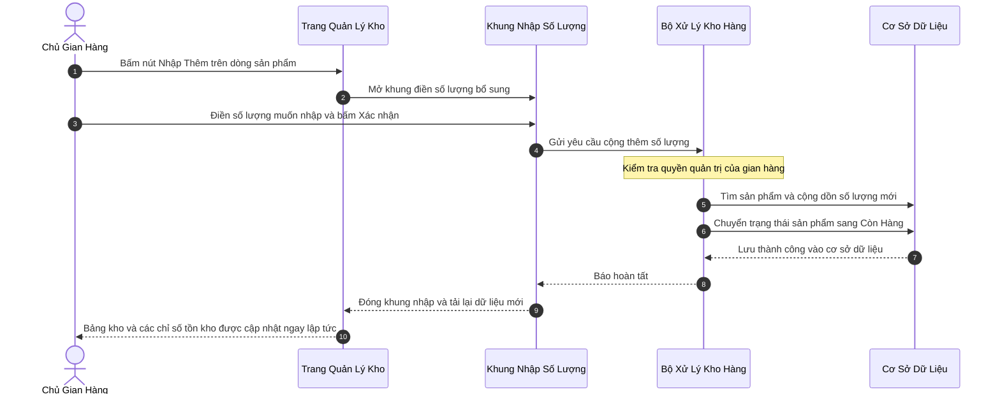
```mermaid
sequenceDiagram
    autonumber
    actor Seller as Chủ Gian Hàng
    participant InvUI as Trang Quản Lý Kho
    participant Modal as Khung Nhập Số Lượng
    participant InvService as Bộ Xử Lý Kho Hàng
    participant DB as Cơ Sở Dữ Liệu

    Seller->>InvUI: Bấm nút Nhập Thêm trên dòng sản phẩm
    InvUI->>Modal: Mở khung điền số lượng bổ sung
    Seller->>Modal: Điền số lượng muốn nhập và bấm Xác nhận
    Modal->>InvService: Gửi yêu cầu cộng thêm số lượng
    
    note over InvService: Kiểm tra quyền quản trị của gian hàng
    InvService->>DB: Tìm sản phẩm và cộng dồn số lượng mới
    InvService->>DB: Chuyển trạng thái sản phẩm sang Còn Hàng
    DB-->>InvService: Lưu thành công vào cơ sở dữ liệu
    
    InvService-->>Modal: Báo hoàn tất
    Modal-->>InvUI: Đóng khung nhập và tải lại dữ liệu mới
    InvUI-->>Seller: Bảng kho và các chỉ số tồn kho được cập nhật ngay lập tức
```

---

### 5. Luồng Cập nhật Trạng thái Đơn hàng và Tra cứu Vận chuyển

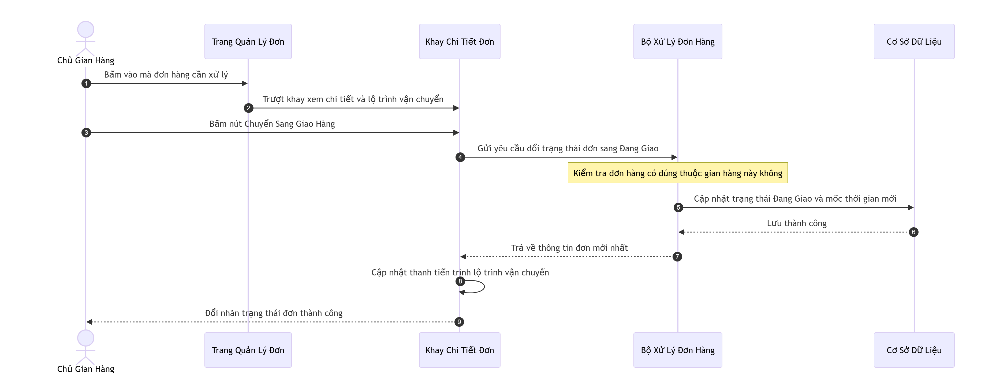

👁️ Nhấn vào đây để xem / chỉnh sửa mã nguồn Mermaid

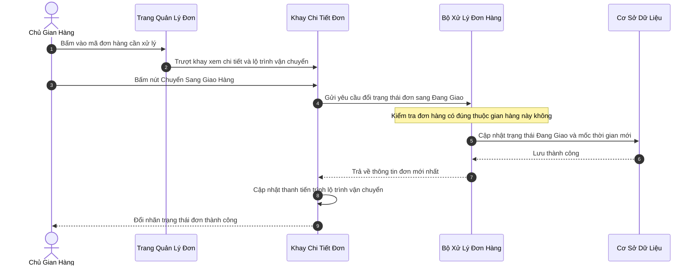
```mermaid
sequenceDiagram
    autonumber
    actor Seller as Chủ Gian Hàng
    participant OrdersUI as Trang Quản Lý Đơn
    participant Drawer as Khay Chi Tiết Đơn
    participant OrderService as Bộ Xử Lý Đơn Hàng
    participant DB as Cơ Sở Dữ Liệu

    Seller->>OrdersUI: Bấm vào mã đơn hàng cần xử lý
    OrdersUI->>Drawer: Trượt khay xem chi tiết và lộ trình vận chuyển
    Seller->>Drawer: Bấm nút Chuyển Sang Giao Hàng
    Drawer->>OrderService: Gửi yêu cầu đổi trạng thái đơn sang Đang Giao
    
    note over OrderService: Kiểm tra đơn hàng có đúng thuộc gian hàng này không
    OrderService->>DB: Cập nhật trạng thái Đang Giao và mốc thời gian mới
    DB-->>OrderService: Lưu thành công
    
    OrderService-->>Drawer: Trả về thông tin đơn mới nhất
    Drawer->>Drawer: Cập nhật thanh tiến trình lộ trình vận chuyển
    Drawer-->>Seller: Đổi nhãn trạng thái đơn thành công
```

---

## 🌐 VII. KIẾN TRÚC TRIỂN KHAI DOCKER (CONTAINER ARCHITECTURE)

Hệ thống được đóng gói hoàn chỉnh thành các dịch vụ Docker độc lập và điều phối bằng **Docker Compose**:

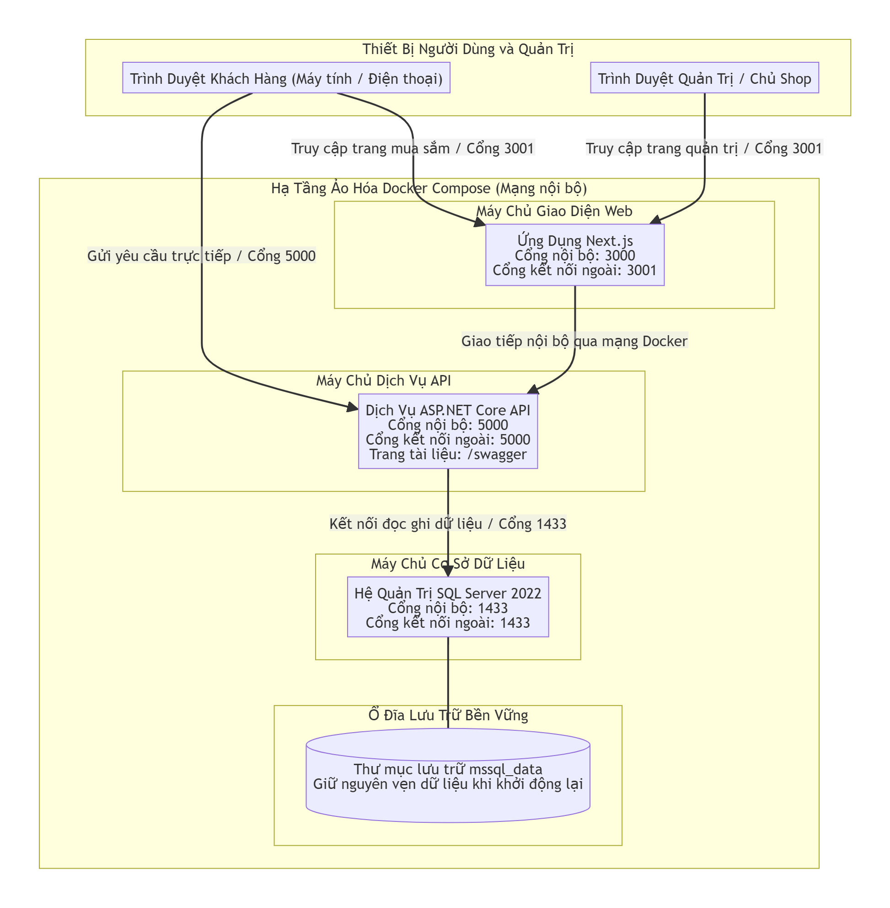

👁️ Nhấn vào đây để xem / chỉnh sửa mã nguồn Mermaid

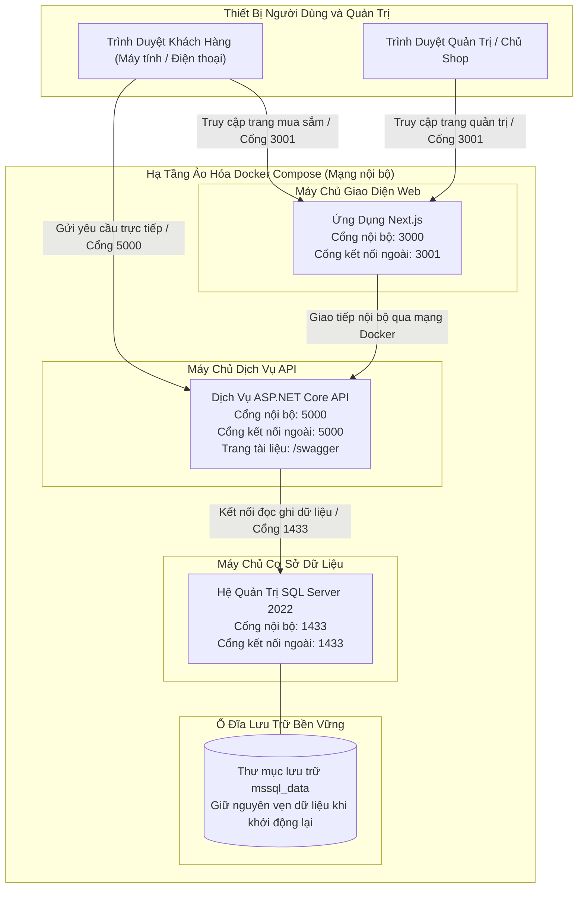
```mermaid
flowchart TD
    subgraph ClientHost ["Thiết Bị Người Dùng và Quản Trị"]
        UserBrowser["Trình Duyệt Khách Hàng (Máy tính / Điện thoại)"]
        AdminBrowser["Trình Duyệt Quản Trị / Chủ Shop"]
    end

    subgraph DockerHost ["Hạ Tầng Ảo Hóa Docker Compose (Mạng nội bộ)"]
        subgraph WebContainer ["Máy Chủ Giao Diện Web"]
            direction TB
            NextEngine["Ứng Dụng Next.js<br/>Cổng nội bộ: 3000<br/>Cổng kết nối ngoài: 3001"]
        end

        subgraph ApiContainer ["Máy Chủ Dịch Vụ API"]
            direction TB
            DotNetEngine["Dịch Vụ ASP.NET Core API<br/>Cổng nội bộ: 5000<br/>Cổng kết nối ngoài: 5000<br/>Trang tài liệu: /swagger"]
        end

        subgraph DbContainer ["Máy Chủ Cơ Sở Dữ Liệu"]
            direction TB
            MssqlEngine["Hệ Quản Trị SQL Server 2022<br/>Cổng nội bộ: 1433<br/>Cổng kết nối ngoài: 1433"]
        end

        subgraph StorageVolume ["Ổ Đĩa Lưu Trữ Bền Vững"]
            VolData[("Thư mục lưu trữ mssql_data<br/>Giữ nguyên vẹn dữ liệu khi khởi động lại")]
        end
    end

    UserBrowser -->|Truy cập trang mua sắm / Cổng 3001| NextEngine
    AdminBrowser -->|Truy cập trang quản trị / Cổng 3001| NextEngine
    UserBrowser -->|Gửi yêu cầu trực tiếp / Cổng 5000| DotNetEngine
    NextEngine -->|Giao tiếp nội bộ qua mạng Docker| DotNetEngine
    DotNetEngine -->|Kết nối đọc ghi dữ liệu / Cổng 1433| MssqlEngine
    MssqlEngine --- VolData
```

### Bảng cấu hình các dịch vụ Docker Compose:
| Tên Dịch Vụ | Ảnh Mẫu (Image) | Cổng Kết Nối (Máy chủ : Ảo) | Vai Trò Chức Năng | Phụ Thuộc |
|---|---|---|---|---|
| **`ecommerce-db`** | `mcr.microsoft.com/mssql/server:2022-latest` | `1433:1433` | Cơ sở dữ liệu quan hệ SQL Server, gắn ổ đĩa `mssql_data` | Không |
| **`ecommerce-api`** | ASP.NET Core 10 Web API | `5000:5000` | Cung cấp dịch vụ API, tự động khởi tạo bảng và dữ liệu | `ecommerce-db` |
| **`ecommerce-web`** | Ứng dụng Next.js 15 Standalone | `3001:3000` | Cung cấp giao diện thời trang và quản trị bán hàng | `ecommerce-api` |

---

## 🛡️ VIII. HÀNG RÀO BẢO MẬT PHÂN QUYỀN (RBAC GUARD)

Hệ thống thiết lập hàng rào bảo mật 3 lớp chặt chẽ giữa Khách hàng, Chủ shop và Quản trị viên:

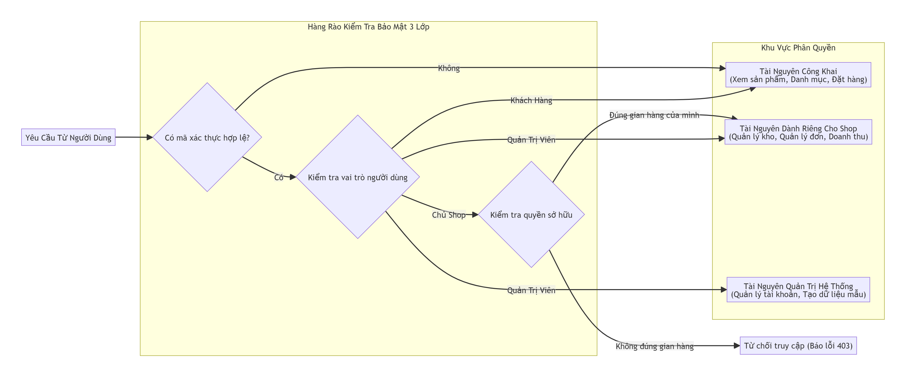

👁️ Nhấn vào đây để xem / chỉnh sửa mã nguồn Mermaid

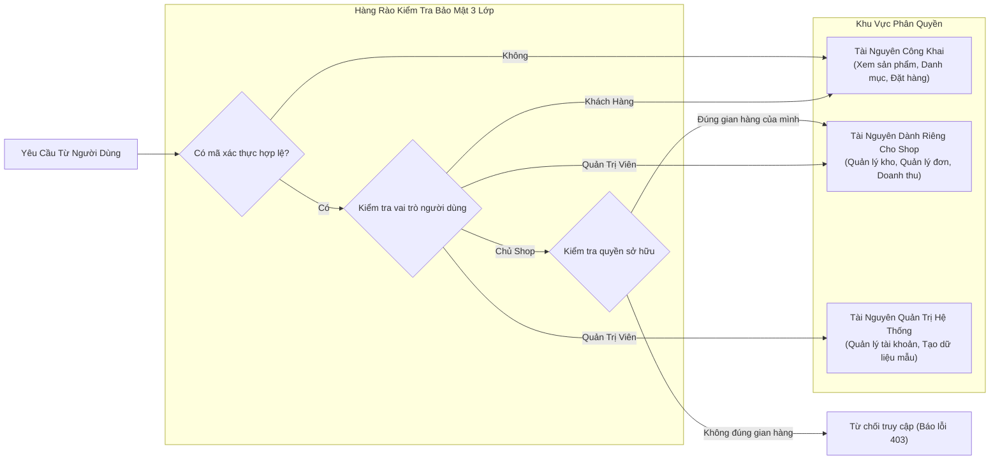
```mermaid
flowchart LR
    Request["Yêu Cầu Từ Người Dùng"]
    
    subgraph GuardLayer ["Hàng Rào Kiểm Tra Bảo Mật 3 Lớp"]
        TokenCheck{"Có mã xác thực hợp lệ?"}
        RoleCheck{"Kiểm tra vai trò người dùng"}
        OwnerCheck{"Kiểm tra quyền sở hữu"}
    end

    subgraph Targets ["Khu Vực Phân Quyền"]
        PublicRes["Tài Nguyên Công Khai<br/>(Xem sản phẩm, Danh mục, Đặt hàng)"]
        SellerRes["Tài Nguyên Dành Riêng Cho Shop<br/>(Quản lý kho, Quản lý đơn, Doanh thu)"]
        AdminRes["Tài Nguyên Quản Trị Hệ Thống<br/>(Quản lý tài khoản, Tạo dữ liệu mẫu)"]
    end

    Request --> TokenCheck
    TokenCheck -- "Không" --> PublicRes
    TokenCheck -- "Có" --> RoleCheck
    
    RoleCheck -- "Khách Hàng" --> PublicRes
    RoleCheck -- "Chủ Shop" --> OwnerCheck
    OwnerCheck -- "Đúng gian hàng của mình" --> SellerRes
    OwnerCheck -- "Không đúng gian hàng" --> Deny["Từ chối truy cập (Báo lỗi 403)"]
    RoleCheck -- "Quản Trị Viên" --> AdminRes
    RoleCheck -- "Quản Trị Viên" --> SellerRes
```

### Bảng Ma trận Phân quyền Chi tiết:

| Chức Năng Hệ Thống | Khách Vãng Lai | Khách Đã Đăng Ký | Chủ Gian Hàng | Quản Trị Viên |
|---|:---:|:---:|:---:|:---:|
| **Xem sản phẩm và Tìm kiếm thông minh** | ✅ Cho phép | ✅ Cho phép | ✅ Cho phép | ✅ Cho phép |
| **Xem chi tiết sản phẩm và Phối đồ AI** | ✅ Cho phép | ✅ Cho phép | ✅ Cho phép | ✅ Cho phép |
| **Thêm vào giỏ và Đặt mua hàng** | ✅ Cho phép | ✅ Cho phép | ✅ Cho phép | ✅ Cho phép |
| **Nhận thông báo cá nhân** | ❌ Chặn | ✅ Thông báo Khách | ✅ Thông báo Shop | ✅ Toàn quyền |
| **Quản lý kho hàng (`/inventory`)** | ❌ Chặn | ❌ Chặn | ✅ Hàng của Shop | ✅ Xem mọi kho |
| **Nhập thêm hàng hóa vào kho** | ❌ Chặn | ❌ Chặn | ✅ Hàng của Shop | ✅ Mọi sản phẩm |
| **Chuyển trạng thái đơn (`/orders`)** | ❌ Chặn | ❌ Chặn | ✅ Đơn thuộc Shop | ✅ Mọi đơn hàng |
| **Xem báo cáo doanh số (`/stats`)** | ❌ Chặn | ❌ Chặn | ✅ Doanh thu Shop | ✅ Toàn hệ thống |
| **Quản trị tài khoản và Khởi tạo dữ liệu** | ❌ Chặn | ❌ Chặn | ❌ Chặn | ✅ Toàn quyền |

---

*Tài liệu thiết kế kiến trúc hệ thống Aethelgard Mall — Bản cập nhật trực quan.*
